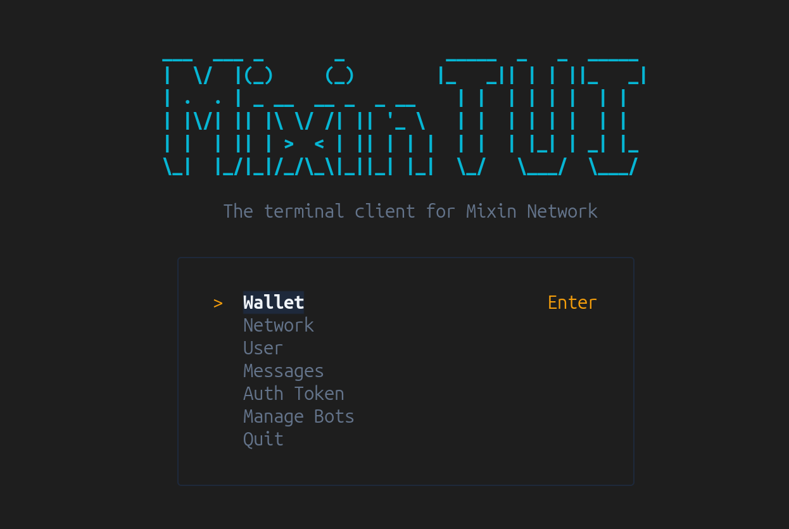

# Mixin TUI



The Terminal User Interface for mixin bot to run different actions like transfer asset, read balance, send messages and more. 

Inspired by [mixin-cli](https://github.com/fox-one/mixin-cli). Written in Typescript, and use @mixin.dev/mixin-node-sdk as basement. 

## Usage

### Run via npx (Recommended)

You can run the TUI directly without cloning the repository if it's published to npm:

```bash
npx mixin-tui
```

### Local Development

1. Copy `mixin-config.json.example` to `mixin-config.json` and fill in your Mixin bot credentials.
2. Run `bun install` to install dependencies.
3. Run `bun run dev` to start the TUI.

### Build from source

To build the executable bundle yourself:

```bash
bun run build
# The executable will be at ./dist/index.js
```

## LISENCE

MIT Lisence
